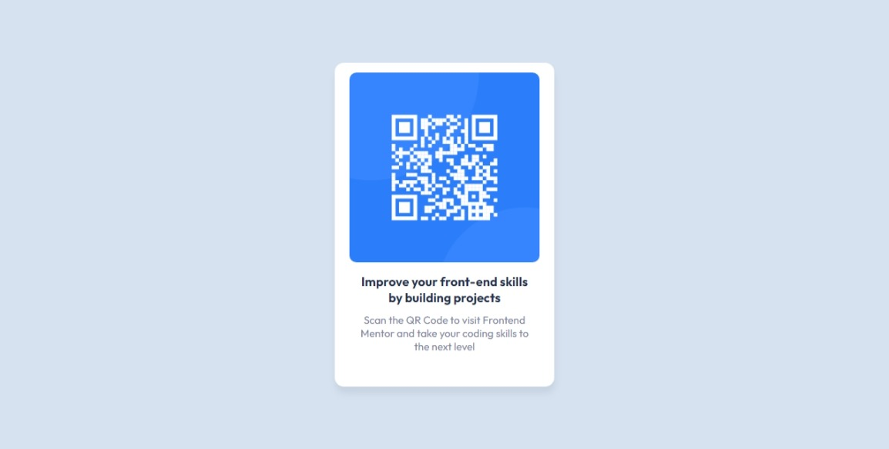

# Frontend Mentor - QR code component

## Sumário

- [Overview](#overview)
  - [Screenshot](#screenshot)
  - [Links](#links)
  - [Feito com](#feito-com)
  - [O que eu aprendi](#o-que-eu-aprendi)
  - [Links úteis](#links-úteis)
- [Autora](#autora)

## Overview

- Componente de QR Code feito com CSS e HTML

### Screenshot

### Links

- Solução no Frontend Mentorr: [Frontend Mentor](https://www.frontendmentor.io/solutions/qr-code-component-8Mg03KNTO-)
- Projeto ao vivo: [Github pages](https://qrcodecomponent.lucylima.github.io)

### Feito com

- HTML5 
- CSS 
- Flexbox

### O que eu aprendi

Eu aprendi conceitos de flexbox e de design limpo com responsividade

### Links úteis

- [Google Fonts](https://www.fonts.google.com) - Extremamente útil para se obter fontes de tamanho e tipos diferentes

## Autora

- Github - [Lucy Lima Santos](https://github.com/lucylima)
- Frontend Mentor - [@lucylima](https://www.frontendmentor.io/profile/lucylima)
